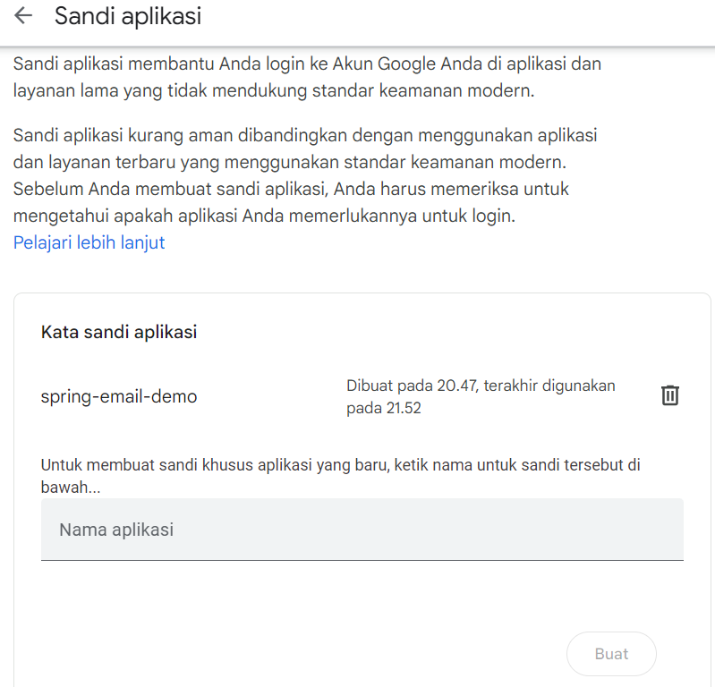

# spring-email-demo
> Demo pengiriman email melalui smtp gmail. Menggunakan Java Mail Sender
---
## Step by step
**1. Dependency**
- Tambahkan dependency spring boot starter email pada pom.
```xml
<dependency>
    <groupId>org.springframework.boot</groupId>
    <artifactId>spring-boot-starter-mail</artifactId>
</dependency>
```
- Jika create project spring boot menggunakan [Spring Initializr](https://start.spring.io/), bisa langsung add dependencies Java Mail Sender.
- Untuk versi terbaru dari dependency spring boot starter email yang tersedia, dapat dilihat pada [Maven Central](https://mvnrepository.com/artifact/org.springframework.boot/spring-boot-starter-mail) repository
 
**2. Application properties**
- setting properties untuk koneksi ke smtp gmail nya
```properties
spring.application.name=spring-email-demo
server.port=8080

spring.mail.host=smtp.gmail.com
spring.mail.port=587
spring.mail.username=fahri@gmail.com
spring.mail.password=xpumtcmktmifksyx
spring.mail.properties.mail.smtp.auth=true
spring.mail.properties.mail.smtp.starttls.enable=true
```

**3. Untuk generate password random email kita:**
- Masuk ke setting keamanan google akun kita
- Aktifkan verifikasi 2 langkah, lalu dibagian paling bawah terdapat sandi aplikasi

- Masukkan nama aplikasi, kita dapat generate password berkali kali untuk masing masing kebutuhan aplikasi kita

**4. Setup controller, dto, dan lainnya untuk membuat api yang dapat di hit.**
 
**5. Service**
- Inject `JavaMailSender`, yang nantinya akan digunakan untuk mengirimkan email nya menggunakan method `.send` dari `JavaMailSender`.
- Instansiasi objek `SimpleEmailMessage`
```java
SimpleMailMessage message = new SimpleMailMessage();
```
- Lalu tinggal kita set atribut objek message tersebut, seperti
  - message.setTo();
  - message.setFrom();
  - message.setText()
  - dll
- Setelah di set, tinggal kita kirim 
```
javaEmailSender.send(message);
```